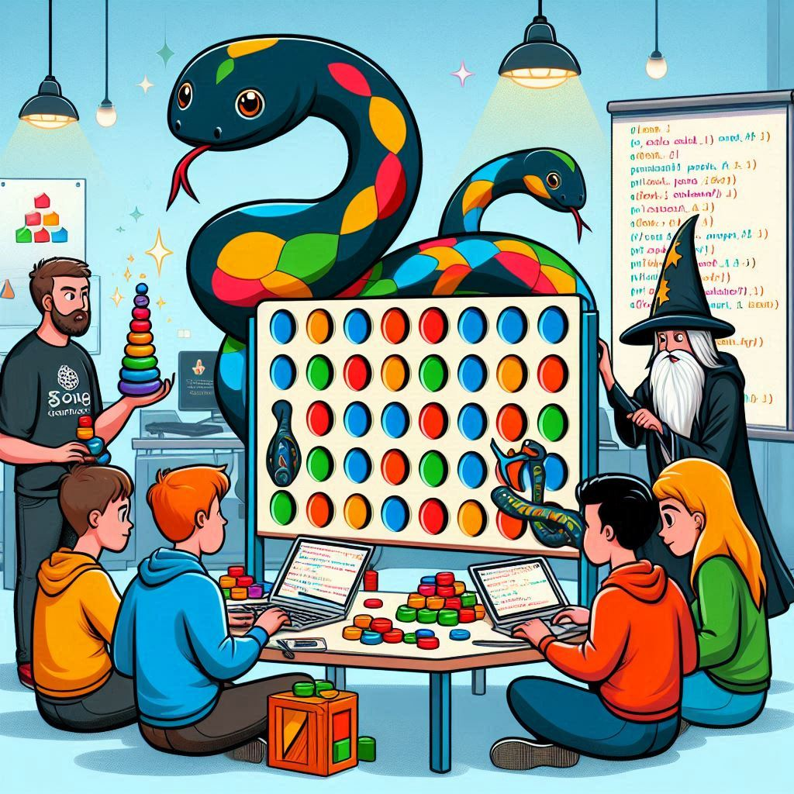

# Event Sourcing From The Ground Up

_Repository for the tutorial "Event Sourcing From The Ground Up" at PyCon US 2025 in
Pittsburgh, PA._

---



---

## 1. Introduction

In this tutorial, we will write an event-sourced version of the game "Connect Four". The
focus of the tutorial is not the game logic, but rather the core mechanisms of Event
Sourcing. That's why you'll implement those mechanisms "from the ground up", without
using frameworks or packages that hide those mechanisms behind magical abstractions.

This tutorial is for you if you’re interested in Event Sourcing but don’t have any real
experience with it yet. We do expect you to have at least an intermediate level in
Python, with some experience in writing (simple) classes.

## 2. Preparation

Please perform the steps in this section to prepare yourself for the tutorial. Due to
the limited bandwidth at the venue, it's advisable to do these set-up steps **before you
come to the venue**.

### 2.1. Prerequisites

Please make sure you have the following prerequisite tools available on your system:

- [Python 3.13.x][install-python] (earlier versions _may_ work, but are not recommended)
- [Poetry (2.x.x)][install-poetry]
- [Git][install-git] [^1]

[^1]: If you cannot use `git` on your system or cannot `clone` repositories from GitHub,
you can also download a zip archive of each branch using your web browser. This is less
convenient than using `git`, but it should work. However, this approach is "at your own
risk", and there are no specific, written instructions for it. (Hint: You may need to
create a virtual environment for each copy or configure your system to use the same
environment for all copies.)

#### 2.1.1. Optional: Container Runtime

**Optionally,** install a container runtime to use a "real" persistence backend for the
last exercise. This isn't strictly necessary, but it does introduce you to a database
optimized for Event Sourcing.

There are two tested options:

- [Podman][install-podman]
- [Docker][install-docker]

You do not need Podman Desktop or Docker Desktop for this tutorial, as CLI-commands are
provided where needed. (There is no harm in using them, though.)

### 2.2. Clone the repository

Open a terminal or command window and navigate to a directory in which you want to clone
the git repository using the `cd`-command. Once you've set your working directory to
that directory, use the following command to clone the repository:

```bash
git clone https://github.com/SebastiaanZ/pycon-2025-event-sourcing.git
```

This will create a directory within your working directory with the repository. Navigate
to that directory or open in it in your favorite editor/IDE.

### 2.3. Setting up your project environment

Open a terminal/command window and navigate to the directory in which you cloned the
repository. Now run the following command to install the dependencies:

```bash
poetry sync
```

If poetry is unable to locate an appropriate version of Python to use, you can create a
virtual environment using the following command (after substituting the path to the
version of Python you want to use):

```bash
poetry env use "<path-to-python-executable-you-want-to-use>"
```

### 2.4. (Optional) Pull Container Image

If you want to use EventStoreDB as a persistence backend, please pull the container
image before travelling to the venue. The bandwidth of the network at the venue is very
limited, and pulling the image during the tutorial may take a long time or not work
at all.

<details>
  <summary><i>Pulling the image with Podman</i></summary>

```bash
podman pull docker.kurrent.io/kurrent-latest/kurrentdb:lts
```

</details>

<details>
  <summary><i>Pulling the image with Docker</i></summary>

```bash
docker pull docker.kurrent.io/kurrent-latest/kurrentdb:lts
```

</details>


[install-python]: https://www.python.org/downloads/

[install-poetry]: https://python-poetry.org/docs/#installation

[install-git]: https://git-scm.com/downloads

[install-podman]: https://podman.io/docs/installation

[install-docker]: https://docs.docker.com/get-docker/

## Agenda

- Introduction: Event Sourcing & Domain-Driven Design
- Modeling Our Events Using Event Sourcing
- Exercise 1: Starting a game & recording our first events
- Exercise 2: Playing the game & checking constraints
- Exercise 3: Finishing the game & persisting events
- Closing Discussion

### Structure

This tutorial is a well-balanced combination of theory and hands-on exercises. We will
alternate between theoretical discussions of the concepts behind Event Sourcing and
exercises that make use of those concepts.

After each exercise block, we will discuss solutions to the exercise problems and have
some room for questions.

### Repository

This repository contains the exercises and solutions to the exercises in different
branches. **Each exercise starts by checking out a specific branch** so we can start
from a common ground.

This also means that if you fall behind in one exercise, you can still join in at the
start of the next exercise.

Note that when we start a new exercise, we don't continue from the solution of the
previous exercise. The branch typically includes more than just the solution to the
previous exercise. You get some parts of the application for free so we can focus on
the Event Sourcing part of it.
